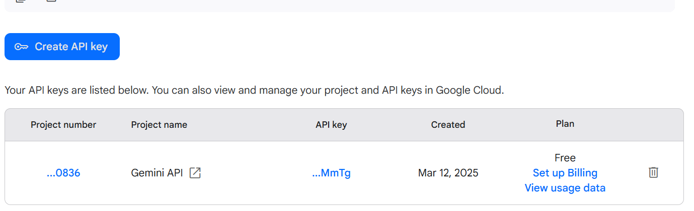

# potplay-gemini

Uses [Gemini](https://gemini.google.com/app) to translate subtitles in real time to and from any of >100 supported languages in [PotPlayer](https://potplayer.daum.net/)

## Installation
- Go to https://aistudio.google.com/app/apikey and register to get Gemini key (if you haven't already)
  
- Download zip file from [releases](https://github.com/OlegYch/potplayer-gemini/releases)
- Unzip to PotPlayer installation folder, eg `C:\Program Files\PotPlayer\Extension\Subtitle\Translate`
- Launch PotPlayer
- Open Settings -> Extensions -> Subtitle Translation:

- Select one of Gemini Engines and click Login...
- Copy the key from first step into 'API Key' field

- Adjust PotPlayer translation settings in context menu if necessary

- Done, enjoy any video with subtitles translated to your language of choice
                              

## Tuning
### Models
- gemini-2.0-flash model is used by default because of its superior translation quality.
- gemini-2.0-flash-lite is used as a fallback when an error occurs, e.g. request quota is exceeded.

At the moment there are two versions of extension with different settings:
- Gemini-Flash-Free uses the best available model for translation and is tuned to be used with free account, by forcing a bit of delay between translation calls.
- Gemini-Flash-Paid uses a bit more relaxed settings for better experience, but can be problematic when using with free account. Try it after you set up Gemini billing. 

Note that free Gemini plan is limited to 1500 translations per day per model, which should probably be enough for a couple of movies.

### Prompt
During extension login you can provide custom translation prompt.

This can be used to adjust translation accuracy or style. You can see the default prompt [here](src/main/as/gemini.as#L7), use it as a sample.

### Fine tuning
A few more settings are available at the start of `*.as` files, you can edit them freely, but don't forget to restart PotPlayer.